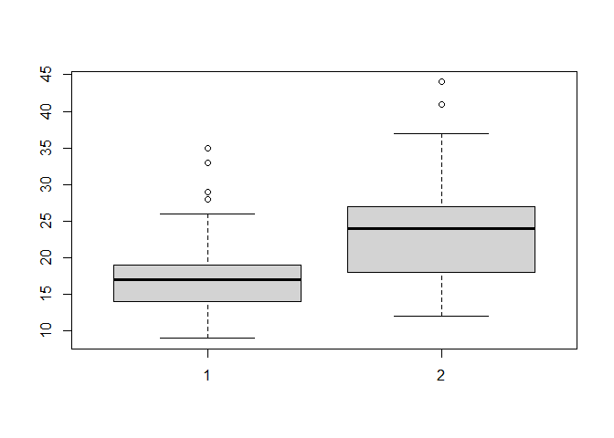
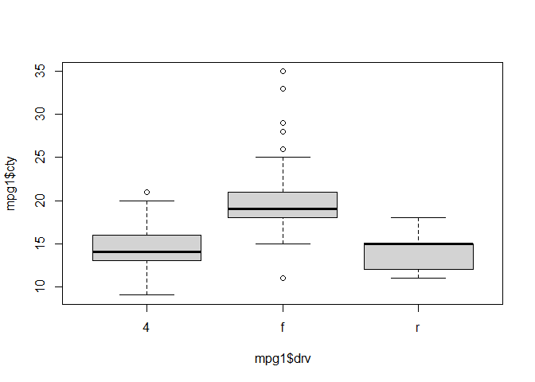
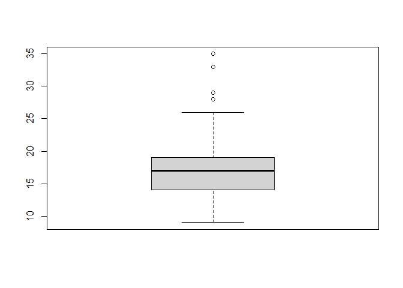

# 7장
### 라이브러리 불러오기
- 작업할 때 항상 라이브러리 불러오기

```r
library(dplyr)
```

```
## 
## 다음의 패키지를 부착합니다: 'dplyr'
```

```
## The following objects are masked from 'package:stats':
## 
##     filter, lag
```

```
## The following objects are masked from 'package:base':
## 
##     intersect, setdiff, setequal, union
```

```r
glimpse(iris)
```

```
## Rows: 150
## Columns: 5
## $ Sepal.Length <dbl> 5.1, 4.9, 4.7, 4.6, 5.0, 5.4, 4.6, 5.0, 4.4, 4.9, 5.4, 4.…
## $ Sepal.Width  <dbl> 3.5, 3.0, 3.2, 3.1, 3.6, 3.9, 3.4, 3.4, 2.9, 3.1, 3.7, 3.…
## $ Petal.Length <dbl> 1.4, 1.4, 1.3, 1.5, 1.4, 1.7, 1.4, 1.5, 1.4, 1.5, 1.5, 1.…
## $ Petal.Width  <dbl> 0.2, 0.2, 0.2, 0.2, 0.2, 0.4, 0.3, 0.2, 0.2, 0.1, 0.2, 0.…
## $ Species      <fct> setosa, setosa, setosa, setosa, setosa, setosa, setosa, s…
```

### 데이터 불러오기

```r
exam_na <- read.csv("data/exam_na.csv")
str(exam_na)
```

```
## 'data.frame':	5 obs. of  5 variables:
##  $ id     : int  1 2 3 4 5
##  $ sex    : chr  "M" "F" "F" "M" ...
##  $ korean : int  87 92 95 NA 87
##  $ english: int  NA 95 92 84 NA
##  $ math   : int  82 93 90 80 88
```
### (1) 결측치 확인
- is.na() : 결측치가 있습니까? / TRUE or FALSE

```r
is.na(exam_na)  # TRUE 가 결측치
```

```
##         id   sex korean english  math
## [1,] FALSE FALSE  FALSE    TRUE FALSE
## [2,] FALSE FALSE  FALSE   FALSE FALSE
## [3,] FALSE FALSE  FALSE   FALSE FALSE
## [4,] FALSE FALSE   TRUE   FALSE FALSE
## [5,] FALSE FALSE  FALSE    TRUE FALSE
```


### (2) 결측치 빈도 구하기
- table(is.na()) : 빈도 구하기

```r
table(is.na(exam_na))          #FALSE 는 결측치가 아닌것, TRUE 는 결측치
```

```
## 
## FALSE  TRUE 
##    22     3
```
- korean 항목의 결측치 구하기

```r
table(is.na(exam_na$korean))
```

```
## 
## FALSE  TRUE 
##     4     1
```
- 변수별로 결측치 빈도 구하기

```r
summary(is.na(exam_na))
```

```
##      id             sex            korean         english       
##  Mode :logical   Mode :logical   Mode :logical   Mode :logical  
##  FALSE:5         FALSE:5         FALSE:4         FALSE:3        
##                                  TRUE :1         TRUE :2        
##     math        
##  Mode :logical  
##  FALSE:5        
## 
```
- 결측치 포함한 전체 통계

```r
summary(exam_na)   # NA's 값이 결측치의 개수
```

```
##        id        sex                korean         english           math     
##  Min.   :1   Length:5           Min.   :87.00   Min.   :84.00   Min.   :80.0  
##  1st Qu.:2   Class :character   1st Qu.:87.00   1st Qu.:88.00   1st Qu.:82.0  
##  Median :3   Mode  :character   Median :89.50   Median :92.00   Median :88.0  
##  Mean   :3                      Mean   :90.25   Mean   :90.33   Mean   :86.6  
##  3rd Qu.:4                      3rd Qu.:92.75   3rd Qu.:93.50   3rd Qu.:90.0  
##  Max.   :5                      Max.   :95.00   Max.   :95.00   Max.   :93.0  
##                                 NA's   :1       NA's   :2
```

# 결측치 처리 방법
### (1) 제거하고 처리하기
- na.rm = T : 'rm'은 remove의 약자. 즉, 결측치를 제거 할 것이냐는 함수

```r
mean(exam_na$korean, na.rm = TRUE)  #TRUE는 제거, FALSE는 제거 안함
```

```
## [1] 90.25
```
- na.omit() : 결측치가 있는 행을 모두 제거
  +가급적 쓰지 말 것
- filter() 함수 활용
  + (!is.na(korean))

```r
exam_na %>% filter(is.na(korean))   #결측치가 있는 열
```

```
##   id sex korean english math
## 1  4   M     NA      84   80
```
- 이번에는 !is.na(korean))을 활용한다

```r
exam_na %>% filter(!is.na(korean))  #!는 not의 의미
```

```
##   id sex korean english math
## 1  1   M     87      NA   82
## 2  2   F     92      95   93
## 3  3   F     95      92   90
## 4  5   F     87      NA   88
```


### (2) 다른 값으로 대체하기
- imputation 참고자료
  + https://www.kdnuggets.com/2017/09/missing-data-imputation-using-r.html
  + [R 결측치(NA) 제거, 대체 방법](https://velog.io/@lifeisbeautiful/R-%EA%B2%B0%EC%B8%A1%EA%B0%92NA-%EC%A0%9C%EA%B1%B0-%EB%8C%80%EC%B2%B4-%EB%B0%A9%EB%B2%95)

#### 평균 입력
- ifelse()를 이용할 때

```r
exam_na$korean   # korean 성적에서 4번째가 NA
```

```
## [1] 87 92 95 NA 87
```
- 결측값을 제외한 값의 평균 구하기

```r
mean(exam_na$korean, na.rm = TRUE)
```

```
## [1] 90.25
```
- 결측값에 평균 입력

```r
exam_na$korean <- ifelse(is.na(exam_na$korean),90.25,exam_na$korean)  #ifelse()함수 이용
```
- korean 성적 확인

```r
exam_na$korean 
```

```
## [1] 87.00 92.00 95.00 90.25 87.00
```


## 이상치
- 데이터의 특정 값이 뭔가 '이상'이 있다.
- Case 1 : 정해진 범주에서 벗어난 데이터
  + 2000년 4월 30일 / 2000년 40월 30일 ---> 9999
- Case 2 : 숫자 / 아웃라이어(Outlier) / 극단값
  + 평균임금 320만원 / 손흥민 몇십억원?

-자료 불러오기

```r
mpg1_out <- read.csv("data/mpg1_out.csv")
glimpse(mpg1_out)
```

```
## Rows: 234
## Columns: 3
## $ trans <int> 1, 2, 2, 1, 1, 2, 1, 2, 1, 2, 1, 1, 2, 1, 2, 1, 1, 1, 1, 3, 1, 1…
## $ drv   <chr> "f", "f", "f", "f", "f", "f", "f", "4", "4", "4", "4", "4", "5",…
## $ cty   <int> 18, 21, 20, 21, 16, 18, 18, 18, 16, 20, 19, 15, 17, 17, 15, 15, …
```

- trans의 갯수를 구하자.

```r
table(mpg1_out$trans)
```

```
## 
##   1   2   3 
## 154  76   4
```
- 쉽게 하는 방법

```r
mpg1_out %>% filter(trans != 3)
```

```
##     trans drv cty
## 1       1   f  18
## 2       2   f  21
## 3       2   f  20
## 4       1   f  21
## 5       1   f  16
## 6       2   f  18
## 7       1   f  18
## 8       2   4  18
## 9       1   4  16
## 10      2   4  20
## 11      1   4  19
## 12      1   4  15
## 13      2   5  17
## 14      1   4  17
## 15      2   4  15
## 16      1   4  15
## 17      1   4  17
## 18      1   4  16
## 19      1   r  14
## 20      1   r  14
## 21      1   r  13
## 22      1   r  12
## 23      2   r  16
## 24      1   r  15
## 25      2   r  16
## 26      1   r  15
## 27      1   4  14
## 28      1   4  11
## 29      1   4  11
## 30      1   4  14
## 31      1   f  19
## 32      1   f  22
## 33      1   f  18
## 34      1   f  18
## 35      1   f  17
## 36      1   f  18
## 37      1   f  17
## 38      1   f  16
## 39      1   f  16
## 40      1   f  17
## 41      1   f  17
## 42      1   f  11
## 43      1   f  15
## 44      1   f  16
## 45      1   f  16
## 46      2   4  15
## 47      1   4  14
## 48      1   4  13
## 49      2   4  14
## 50      1   4  14
## 51      1   4  14
## 52      1   5   9
## 53      2   4  11
## 54      1   4  11
## 55      1   4  13
## 56      1   4  13
## 57      1   4   9
## 58      1   4  11
## 59      1   4  13
## 60      1   4  11
## 61      2   4  12
## 62      1   4   9
## 63      1   4  13
## 64      1   4  13
## 65      2   4  12
## 66      2   4   9
## 67      1   4  11
## 68      2   4  11
## 69      1   4  13
## 70      1   4  11
## 71      1   r  11
## 72      1   r  11
## 73      1   r  12
## 74      1   4  14
## 75      2   4  15
## 76      1   4  14
## 77      1   4  13
## 78      1   4  13
## 79      1   5  13
## 80      1   4  14
## 81      2   4  14
## 82      2   4  13
## 83      1   4  13
## 84      1   4  13
## 85      1   4  11
## 86      1   4  13
## 87      2   r  18
## 88      1   r  18
## 89      2   r  17
## 90      1   r  16
## 91      1   r  15
## 92      2   r  15
## 93      2   r  15
## 94      1   r  15
## 95      2   r  14
## 96      2   f  28
## 97      1   f  24
## 98      2   f  25
## 99      2   f  23
## 100     1   f  24
## 101     2   f  26
## 102     1   f  25
## 103     1   f  24
## 104     2   f  21
## 105     1   f  18
## 106     2   f  18
## 107     1   f  21
## 108     2   f  21
## 109     1   f  18
## 110     2   f  18
## 111     1   f  19
## 112     1   f  19
## 113     2   f  19
## 114     2   f  20
## 115     1   f  20
## 116     1   f  17
## 117     2   f  16
## 118     2   f  17
## 119     1   4  17
## 120     1   4  15
## 121     1   4  15
## 122     1   4  14
## 123     1   4   9
## 124     1   4  14
## 125     1   4  13
## 126     1   4  11
## 127     1   4  11
## 128     1   4  12
## 129     1   4  12
## 130     1   4  11
## 131     1   r  11
## 132     1   r  11
## 133     1   r  12
## 134     1   4  14
## 135     1   4  13
## 136     1   4  13
## 137     1   4  13
## 138     2   f  21
## 139     1   f  19
## 140     1   f  23
## 141     2   f  23
## 142     2   f  19
## 143     1   f  19
## 144     1   f  18
## 145     2   f  19
## 146     1   f  19
## 147     1   4  14
## 148     2   4  15
## 149     1   4  14
## 150     1   4  12
## 151     1   f  18
## 152     1   f  16
## 153     1   f  17
## 154     1   f  18
## 155     1   f  16
## 156     2   4  18
## 157     1   4  18
## 158     2   4  20
## 159     2   4  19
## 160     1   4  20
## 161     1   4  18
## 162     1   4  21
## 163     2   4  19
## 164     2   4  19
## 165     1   4  19
## 166     1   4  20
## 167     1   4  20
## 168     2   4  19
## 169     2   4  20
## 170     2   4  15
## 171     1   4  16
## 172     1   4  15
## 173     2   4  15
## 174     1   4  16
## 175     1   4  14
## 176     2   f  21
## 177     1   f  21
## 178     2   f  21
## 179     1   f  21
## 180     1   f  18
## 181     2   f  18
## 182     1   f  19
## 183     1   f  21
## 184     2   f  21
## 185     2   f  21
## 186     1   f  22
## 187     1   f  18
## 188     2   f  18
## 189     1   f  18
## 190     1   f  24
## 191     1   f  24
## 192     2   f  26
## 193     2   f  28
## 194     1   f  26
## 195     1   4  11
## 196     1   4  13
## 197     2   4  15
## 198     1   4  16
## 199     2   4  17
## 200     2   4  15
## 201     1   4  15
## 202     2   4  15
## 203     1   4  16
## 204     2   f  21
## 205     1   f  19
## 206     2   f  21
## 207     1   f  22
## 208     2   f  17
## 209     2   f  33
## 210     2   f  21
## 211     1   f  19
## 212     1   f  22
## 213     2   f  21
## 214     1   f  21
## 215     2   f  21
## 216     1   f  16
## 217     2   f  17
## 218     2   f  35
## 219     1   f  29
## 220     2   f  21
## 221     1   f  19
## 222     2   f  20
## 223     1   f  20
## 224     2   f  21
## 225     1   f  18
## 226     1   f  19
## 227     2   f  21
## 228     1   f  16
## 229     2   f  18
## 230     1   f  17
```

- ifelse

```r
mpg1_out$trans <- ifelse(mpg1_out$trans == 3, NA, mpg1_out$trans)
# trans의 값이 3이면 결측치(NA)로 바꿔주고, 아니면 그대로 두어라
table(is.na(mpg1_out$trans))
```

```
## 
## FALSE  TRUE 
##   230     4
```

- 결측치 제거

```r
result <- mpg1_out %>% filter(!is.na(trans))  # 결측치가 아닌 것들을 'result' 데이터로 지정
```
- 결측치가 아닌 것들을 표현

```r
table(is.na(result$trans)) 
```

```
## 
## FALSE 
##   230
```


### 극단치 처리
- 숫자 데이터 boxplot()
- boxplot() 함수를 통해서 극단치가 있는지 없는 확인지 가능
- IQR : 1사분위 ~ 3사분위
- 경계값 : IQR + IQR * 1.5 상한/ IQR - IQR * 1.5

```r
mpg1 <- read.csv("data/mpg1.csv")
boxplot(mpg1$cty)
```

<!-- -->

- cty 변수의 통계값

```r
boxplot(mpg1$cty)$stats
```

<!-- -->

```
##      [,1]
## [1,]    9
## [2,]   14
## [3,]   17
## [4,]   19
## [5,]   26
```
- cty와 hwy의 통계값

```r
boxplot(mpg1$cty, mpg1$hwy)$stats 
```

<!-- -->

```
##      [,1] [,2]
## [1,]    9   12
## [2,]   14   18
## [3,]   17   24
## [4,]   19   27
## [5,]   26   37
```
- drv 범주별 cty 통계값

```r
boxplot(mpg1$cty~mpg1$drv)$stats 
```

<!-- -->

```
##      [,1] [,2] [,3]
## [1,]    9   15   11
## [2,]   13   18   12
## [3,]   14   19   15
## [4,]   16   21   15
## [5,]   20   25   18
```
- cty의 극단치 기준 알아보기

```r
boxplot(mpg1$cty)$stats      
```

<!-- -->

```
##      [,1]
## [1,]    9
## [2,]   14
## [3,]   17
## [4,]   19
## [5,]   26
```
- ifelse함수를 활용한다

```r
mpg1$cty <- ifelse(mpg1$cty>26|mpg1$cty<9, NA, mpg1$cty)
# cty 값이 26 초과, 9 미만인 경우에 결측치(NA)로 처리하고, 아닌경우 그대로 둔다.
```
- 결측치 확인

```r
table(is.na(mpg1$cty))
```

```
## 
## FALSE  TRUE 
##   229     5
```
- 결측치를 제외한 cty 평균 구하기

```r
mean(mpg1$cty,na.rm = TRUE)  
```

```
## [1] 16.55895
```
- 또는 이렇게 쓸 수도 있다

```r
mpg1$cty <- ifelse(mpg1$cty>=9 & mpg1$cty<=26, mpg1$cty, NA)
# cty 값이 9 이상 26 이하인 경우 그대로 두고, 아닌경우 결측치(NA)로 처리한다.
```
