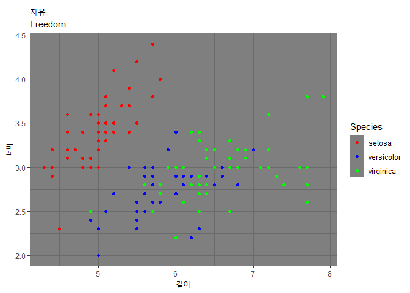

- iris 데이터, sepal.length, sepal.width 활용해서 종별로 산점도를 그리세요
  + 제목과 X축, Y축 제목을 변경하세요
  + 제목은 자유
  + X축 -> 길이, Y축 -> 너비


```r
library(ggplot2)

str(iris)
```

```
## 'data.frame':	150 obs. of  5 variables:
##  $ Sepal.Length: num  5.1 4.9 4.7 4.6 5 5.4 4.6 5 4.4 4.9 ...
##  $ Sepal.Width : num  3.5 3 3.2 3.1 3.6 3.9 3.4 3.4 2.9 3.1 ...
##  $ Petal.Length: num  1.4 1.4 1.3 1.5 1.4 1.7 1.4 1.5 1.4 1.5 ...
##  $ Petal.Width : num  0.2 0.2 0.2 0.2 0.2 0.4 0.3 0.2 0.2 0.1 ...
##  $ Species     : Factor w/ 3 levels "setosa","versicolor",..: 1 1 1 1 1 1 1 1 1 1 ...
```

```r
ggplot(iris, aes(x = Sepal.Length, 
                 y =Sepal.Width, colour = Species)) +
  geom_point()+
  labs(
    title = "자유",
    subtitle = "Freedom",
    x = "길이",
    y = "너비",
    ) +
  
  # 항목별로 색깔 바꾸기
  scale_color_manual(    
    labels = c("setosa", "versicolor", "virginica"),
    values = c("red", "blue", "green")
  ) +
  
  #그래프 테마 바꾸기
  theme_dark()
```

<!-- -->


### - 똑같은 코드 입력은 의미 없다. 다른 데이터로 만들어 볼 것!!!   
<br><br>
