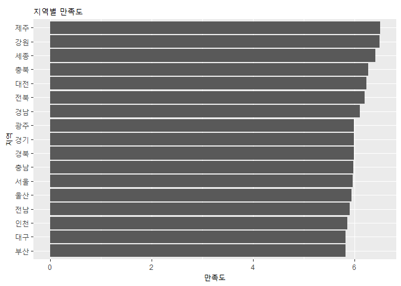

- 연구 1 : 삶의 만족도와 외로움이 자살충동에 주는 영향을 알아본다.
- 연구 2 : 삶의 만족도와 외로움의 상관관계를 알아본다.
- 연구 3 : 가족신뢰도, 경제적 안정, 건강상태가 삶의 만족도와 외로움에 주는 영향을 알아본다.
- 연구 4 : 성, 연령, 지역에 따라 삶의 만족도에 차이가 있는지를 알아본다.

- 데이터 불러오기 전 사전준비

```r
library(dplyr)
```

```
## 
## 다음의 패키지를 부착합니다: 'dplyr'
```

```
## The following objects are masked from 'package:stats':
## 
##     filter, lag
```

```
## The following objects are masked from 'package:base':
## 
##     intersect, setdiff, setequal, union
```

```r
library(ggplot2)
```

- spss 패키지 설치

```r
install.packages("foreign",repos = "http://cran.us.r-project.org")
```

```
## 'C:/Users/human/AppData/Local/R/win-library/4.2'의 위치에 패키지(들)을 설치합니다.
## (왜냐하면 'lib'가 지정되지 않았기 때문입니다)
```

```
## 패키지 'foreign'를 성공적으로 압축해제하였고 MD5 sums 이 확인되었습니다
```

```
## Warning: 패키지 'foreign'의 이전설치를 삭제할 수 없습니다
```

```
## Warning in file.copy(savedcopy, lib, recursive = TRUE): C:
## \Users\human\AppData\Local\R\win-library\4.2\00LOCK\foreign\libs\x64\foreign.dll
## 를 C:\Users\human\AppData\Local\R\win-library\4.2\foreign\libs\x64\foreign.dll로
## 복사하는데 문제가 발생했습니다: Permission denied
```

```
## Warning: 'foreign'를 복구하였습니다
```

```
## 
## 다운로드된 바이너리 패키지들은 다음의 위치에 있습니다
## 	C:\Users\human\AppData\Local\Temp\Rtmp8wYAeo\downloaded_packages
```

```r
library(foreign)
```
- 데이터 불러오기

```r
mental <- read.spss("한국행정연구원_사회통합실태조사_데이터_2019.sav")
```

```
## re-encoding from CP51949
```

```r
class(mental)   # 데이터 유형 확인
```

```
## [1] "list"
```

```r
mental <- as.data.frame(mental)   #데이터프레임으로 변환하기
class(mental)   # 데이터 유형 확인
```

```
## [1] "data.frame"
```

- 분석 변수 추출 후 이름 변경하기

```r
mental <- mental %>% 
  select(q32_2, q1_4, q32_1,q34_1, q52,d17,d1,d2,ara) %>% 
  rename(#자살하고 싶은 생각이 드는 정도, 4점 척도
         suicide=q32_2,
         #요즘 느끼는 삶에 대한 만족도, 등현등간척도, 11점
         satisfaction=q1_4,
         #외롭다고 느끼는 정도, 4점 척도
         loneliness=q32_1,
         #본인의 가족에 대한 신뢰도, 4점 척도
         family_belief=q34_1,
         #본인 경제상황의 안정도, 등현등간척도, 0~10점
         wealth=q52,
         #건강상태, 5점
         health=d17,
         #성별
         sex=d1,
         #연령대, 5등 등급
         age=d2,
         #지역
         area=ara)
```
- 4점, 5점, 11점 척도별 응답빈도 확인

```r
table(mental$suicide)
```

```
## 
## 전혀 그렇지 않다 별로 그렇지 않다      약간 그렇다      매우 그렇다 
##             5592             1862              479               67
```

```r
table(mental$health)
```

```
## 
## 매우 나쁘다 나쁜 편이다    보통이다 좋은 편이다   매우 좋다 
##          87         509        2413        3730        1261
```

```r
table(mental$satisfaction)
```

```
## 
## 0점 전혀 만족하지 않는다                      1점                      2점 
##                       49                       79                      170 
##                      3점                      4점                 5점 보통 
##                      302                      440                     2053 
##                      6점                      7점                      8점 
##                     1611                     1761                     1040 
##                      9점       10점 매우 만족한다              모름/무응답 
##                      321                      174                        0
```

```r
# 모름/무응답 항목때문에 11점 척도인데 범주수는 12개로 나옴
# 결측치가 없으므로 패스
```

- 범주 이름을 문자에서 숫자로 변환하기

```r
mental$suicide <- as.integer(mental$suicide)
mental$satisfaction <- as.integer(mental$satisfaction)
mental$loneliness <- as.integer(mental$loneliness)
mental$family_belief <- as.integer(mental$family_belief)
mental$wealth <- as.integer(mental$wealth)
mental$health <- as.integer(mental$health)
table(mental$suicide)
```

```
## 
##    1    2    3    4 
## 5592 1862  479   67
```

```r
table(mental$health)
```

```
## 
##    1    2    3    4    5 
##   87  509 2413 3730 1261
```

```r
table(mental$satisfaction)
```

```
## 
##    1    2    3    4    5    6    7    8    9   10   11 
##   49   79  170  302  440 2053 1611 1761 1040  321  174
```

- satisfaction 변수는 범주가 0 ~ 10 점 척도인데, 1 ~ 11점으로 출력됨
- 등현등간척도 변수(satisfaction, wealth)에서 -1점 보정작업

```r
mental$satisfaction <- mental$satisfaction-1
mental$wealth <- mental$wealth-1
table(mental$satisfaction)
```

```
## 
##    0    1    2    3    4    5    6    7    8    9   10 
##   49   79  170  302  440 2053 1611 1761 1040  321  174
```

- sex, age, area의 유형을 범주형에서 문자형으로 변경

```r
mental$age <- as.character(mental$age)
mental$sex <- as.character(mental$sex)
mental$area <- as.character(mental$area)
table(mental$sex)
```

```
## 
## 남성 여성 
## 4011 3989
```

```r
table(mental$age)
```

```
## 
## 19~29세    30대    40대    50대 60~69세 
##    1542    1516    1769    1821    1352
```

```r
table(mental$area)
```

```
## 
## 강원 경기 경남 경북 광주 대구 대전 부산 서울 세종 울산 인천 전남 전북 제주 충남 
##  388 1103  527  466  353  464  356  539  965  162  324  522  395  381  267  425 
## 충북 
##  363
```

- age 항목의 19~29세, 60~69세를 20대, 60대로 변경

```r
mental$age <- ifelse(mental$age=="19~29세","20대",
                     ifelse(mental$age=="60~69세","60대",mental$age))
table(mental$age)
```

```
## 
## 20대 30대 40대 50대 60대 
## 1542 1516 1769 1821 1352
```

- 결측치, 이상치 확인하기

```r
summary(mental)
```

```
##     suicide       satisfaction      loneliness    family_belief  
##  Min.   :1.000   Min.   : 0.000   Min.   :1.000   Min.   :1.000  
##  1st Qu.:1.000   1st Qu.: 5.000   1st Qu.:1.000   1st Qu.:3.000  
##  Median :1.000   Median : 6.000   Median :2.000   Median :4.000  
##  Mean   :1.378   Mean   : 6.037   Mean   :1.795   Mean   :3.576  
##  3rd Qu.:2.000   3rd Qu.: 7.000   3rd Qu.:2.000   3rd Qu.:4.000  
##  Max.   :4.000   Max.   :10.000   Max.   :4.000   Max.   :4.000  
##      wealth           health          sex                age           
##  Min.   : 0.000   Min.   :1.000   Length:8000        Length:8000       
##  1st Qu.: 4.000   1st Qu.:3.000   Class :character   Class :character  
##  Median : 5.000   Median :4.000   Mode  :character   Mode  :character  
##  Mean   : 4.985   Mean   :3.696                                        
##  3rd Qu.: 6.000   3rd Qu.:4.000                                        
##  Max.   :10.000   Max.   :5.000                                        
##      area          
##  Length:8000       
##  Class :character  
##  Mode  :character  
##                    
##                    
## 
```

## 데이터 분석
- 빈도분석
  + 성별 빈도분석

```r
mental %>% 
  group_by(sex) %>%                 # sex 변수로 분류
  summarise(n=n()) %>%              # sex 변수의 데이터를 세어서 빈도를 n에 입력한다
  mutate(total=sum(n),              # total에 데이터 빈도 합을 넣고
         pct=round(n/total*100,1))  # 데이터 빈도를 소숫점 1번째 자리까지 백분율로 구한다
```

```
## # A tibble: 2 × 4
##   sex       n total   pct
##   <chr> <int> <int> <dbl>
## 1 남성   4011  8000  50.1
## 2 여성   3989  8000  49.9
```
  
  + 연령대별 빈도분석

```r
# 성별 빈도분석이랑 동일하다.
mental %>% 
  group_by(age) %>% 
  summarise(n=n()) %>% 
  mutate(total=sum(n),
         pct=round(n/total*100,1))
```

```
## # A tibble: 5 × 4
##   age       n total   pct
##   <chr> <int> <int> <dbl>
## 1 20대   1542  8000  19.3
## 2 30대   1516  8000  19  
## 3 40대   1769  8000  22.1
## 4 50대   1821  8000  22.8
## 5 60대   1352  8000  16.9
```
  
- 성별, 연령대 교차분석

```r
# 성별 연령대 별로 고르게 분포되어 있는가?
table(mental$sex, mental$age)
```

```
##       
##        20대 30대 40대 50대 60대
##   남성  822  745  900  891  653
##   여성  720  771  869  930  699
```

```r
round(prop.table(table(mental$sex, mental$age),1)*100,1)
```

```
##       
##        20대 30대 40대 50대 60대
##   남성 20.5 18.6 22.4 22.2 16.3
##   여성 18.0 19.3 21.8 23.3 17.5
```

```r
chisq.test(mental$sex, mental$age)
```

```
## 
## 	Pearson's Chi-squared test
## 
## data:  mental$sex and mental$age
## X-squared = 10.076, df = 4, p-value = 0.03916
```

```r
# p-value 값이 0.05 미만이므로 남녀 연령대 별로 분포비율은 다소 차이가 있다고 할 수 있다.
```

- 평균분석
  + suicide, satisfaction, loneliness, family_belief, wealth, health 변수의 평균을 분석한다.

```r
mental %>% 
  summarise(자살충동=mean(suicide),
            삶의_만족도 = mean(satisfaction),
            외로움=mean(loneliness),
            가족신뢰도=mean(family_belief),
            경제안정도=mean(wealth),
            건강상태=mean(health))
```

```
##   자살충동 삶의_만족도 외로움 가족신뢰도 경제안정도 건강상태
## 1 1.377625      6.0365  1.795   3.576375   4.985125 3.696125
```
  
### 연구문제 1
- 삶의 만족도와 외로움이 자살충동에 미치는 영향

```r
# 삶의 만족도와 외로움을 독립변수, 
#             자살충동을 종속변수
RA <- lm(data=mental, suicide~satisfaction+loneliness)
summary(RA)
```

```
## 
## Call:
## lm(formula = suicide ~ satisfaction + loneliness, data = mental)
## 
## Residuals:
##      Min       1Q   Median       3Q      Max 
## -1.50517 -0.40228 -0.03487  0.17773  3.07029 
## 
## Coefficients:
##               Estimate Std. Error t value Pr(>|t|)    
## (Intercept)   1.035551   0.029823   34.72   <2e-16 ***
## satisfaction -0.052583   0.003614  -14.55   <2e-16 ***
## loneliness    0.367405   0.007987   46.00   <2e-16 ***
## ---
## Signif. codes:  0 '***' 0.001 '**' 0.01 '*' 0.05 '.' 0.1 ' ' 1
## 
## Residual standard error: 0.5451 on 7997 degrees of freedom
## Multiple R-squared:  0.2668,	Adjusted R-squared:  0.2666 
## F-statistic:  1455 on 2 and 7997 DF,  p-value: < 2.2e-16
```

- 자살충동 = 1.035551 - 0.052583 x 만족도 + 0.367405 x 외로움  
<br>  
- 이 회귀식의 설명력은 0.2666 으로 낮은 편이다.
### 연구문제2
- 삶의 만족도와 외로움의 상관관계

```r
cor.test(mental$satisfaction, mental$loneliness)
```

```
## 
## 	Pearson's product-moment correlation
## 
## data:  mental$satisfaction and mental$loneliness
## t = -25.374, df = 7998, p-value < 2.2e-16
## alternative hypothesis: true correlation is not equal to 0
## 95 percent confidence interval:
##  -0.2931116 -0.2525481
## sample estimates:
##        cor 
## -0.2729512
```

```r
# p-value 값이 0.05 미만이므로 유의미한 통계이다.
# 삶의 만족도와 외로움은 약한 수준에서 부적인 상관관계에 있다.
# 즉, 삶의 만족도가 높아지면 외로움이 약간 줄어드는 관계이다.
```

### 연구문제3
- 가족신뢰도, 경제안정도, 건강상태가 삶의 만족도와 외로움에 미치는 영향
<br>  
- 3개 독립변수가 삶의 만족도에 미치는 영향

```r
RA <- lm(data = mental, satisfaction~family_belief+wealth+health)
summary(RA)
```

```
## 
## Call:
## lm(formula = satisfaction ~ family_belief + wealth + health, 
##     data = mental)
## 
## Residuals:
##     Min      1Q  Median      3Q     Max 
## -6.8274 -0.9431 -0.0425  1.0569  6.1986 
## 
## Coefficients:
##               Estimate Std. Error t value Pr(>|t|)    
## (Intercept)    2.07613    0.13765   15.08   <2e-16 ***
## family_belief  0.36851    0.03196   11.53   <2e-16 ***
## wealth         0.26016    0.01089   23.88   <2e-16 ***
## health         0.36403    0.02206   16.50   <2e-16 ***
## ---
## Signif. codes:  0 '***' 0.001 '**' 0.01 '*' 0.05 '.' 0.1 ' ' 1
## 
## Residual standard error: 1.627 on 7996 degrees of freedom
## Multiple R-squared:  0.1386,	Adjusted R-squared:  0.1383 
## F-statistic: 428.8 on 3 and 7996 DF,  p-value: < 2.2e-16
```

```r
# p-value 값이 0.05 미만이므로 유의미한 통계이다.
```

- 삶의 만족도 = 2.07613 + 0.36851 x 가족신뢰도 + 0.26016 x 경제안정도 + 0.36403 x 건강상태
<br>  
- 영향력은 차이가 있지만 가족신뢰도, 경제안정도, 건강상태가 좋아지면 모두 삶의 만족도에 긍정적인 영향을 끼친다.
- 이 회귀식의 설명력은 0.1383 으로 매우 낮은 편이다.
<br> 
- 3개 독립변수가 외로움에 미치는 영향

```r
RA <- lm(data=mental, loneliness~family_belief+wealth+health)
summary(RA)
```

```
## 
## Call:
## lm(formula = loneliness ~ family_belief + wealth + health, data = mental)
## 
## Residuals:
##      Min       1Q   Median       3Q      Max 
## -2.24066 -0.64247  0.01863  0.43022  2.83959 
## 
## Coefficients:
##                Estimate Std. Error t value Pr(>|t|)    
## (Intercept)    3.652247   0.063109   57.87   <2e-16 ***
## family_belief -0.220274   0.014654  -15.03   <2e-16 ***
## wealth        -0.072686   0.004995  -14.55   <2e-16 ***
## health        -0.191313   0.010116  -18.91   <2e-16 ***
## ---
## Signif. codes:  0 '***' 0.001 '**' 0.01 '*' 0.05 '.' 0.1 ' ' 1
## 
## Residual standard error: 0.746 on 7996 degrees of freedom
## Multiple R-squared:  0.1157,	Adjusted R-squared:  0.1154 
## F-statistic: 348.9 on 3 and 7996 DF,  p-value: < 2.2e-16
```

```r
# p-value 값이 0.05 미만이므로 유의미한 통계이다.
```

- 외로움 = 3.652247 - 0.220274 x 가족신뢰도 - 0.072686 x 경제안정도 - 0.191313 x 건강상태
<br>  
- 영향력은 다르지만 가족신뢰도, 경제안정도, 건강상태가 나빠질 수록 외로움도 커진다.
- 이 회귀식의 설명력은 0.1154로 매우 낮은편이다.
<br>  
### 연구문제4
- 성, 연령, 지역별 삶의 만족도 차이
<br>  
- 성별로 삶의 만족도에서 차이가 있는지 독립표본 t 검정으로 알아본다.

```r
t.test(data=mental, satisfaction~sex)
```

```
## 
## 	Welch Two Sample t-test
## 
## data:  satisfaction by sex
## t = -3.7719, df = 7997.6, p-value = 0.0001632
## alternative hypothesis: true difference in means between group 남성 and group 여성 is not equal to 0
## 95 percent confidence interval:
##  -0.22446298 -0.07094075
## sample estimates:
## mean in group 남성 mean in group 여성 
##           5.962852           6.110554
```

```r
# p-value 값이 0.05 미만이므로 유의미한 통계이다.
```

- 남성 평균은 5.962852, 여성 평균은 6.110554 이므로 여성의 만족도가 남성보다 높다고 할 수 있다.
<br>  
- 연령대별 삶의 만족도 차이

```r
mental %>% 
  group_by(age) %>% 
  summarise(삶의_만족도_평균=mean(satisfaction)) %>% 
  arrange(desc(삶의_만족도_평균))
```

```
## # A tibble: 5 × 2
##   age   삶의_만족도_평균
##   <chr>            <dbl>
## 1 30대              6.13
## 2 50대              6.08
## 3 40대              6.05
## 4 20대              6.04
## 5 60대              5.84
```

- 30대가 평균 6.13점으로 가장 높고 60대가 되면 삶의 만족도가 낮아진다.
<br>  

- 지역별 삶의 만족도 분석

```r
area_satisfaction <- mental %>% 
  group_by(area) %>% 
  summarise(m=mean(satisfaction)) %>% 
  arrange(desc(m))
```
- 그래프로 나타내기

```r
library(ggplot2)
ggplot(data=area_satisfaction, aes(x = reorder(area, m),y=m))+
  geom_col()+
  ggtitle("지역별 만족도") + 
  labs(
    x = "지역",
    y = "만족도") +
  coord_flip()
```

<!-- -->


